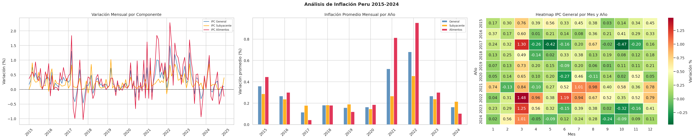

# Análisis de Inflación en el Perú (2015-2024)

## Descripción
Este proyecto analiza cómo varió la inflación en el Perú 
en el período 2015-2024 usando los datos del IPC General, 
IPC Subyacente e IPC Alimentos y Energía, extraídos del BCRP. 
Se usó Python para limpiar los datos y generar las visualizaciones.

## Hallazgos principales
- El año más inflacionario fue **2022 con 8.16% acumulado** 
  y el menos inflacionario fue **2017 con 1.37%**
- El mes con mayor inflación fue **marzo 2022 (1.48%)**, 
  coincidiendo con el inicio de la guerra Rusia-Ucrania
- El análisis estacional muestra que **marzo tiene 
  sistemáticamente mayor inflación**, asociado al inicio 
  del año escolar y estacionalidad de alimentos
- El IPC de Alimentos y Energía es el componente más volátil 
  (desv. estándar = 0.598), mientras que el IPC Subyacente 
  se mantuvo estable — indicando que la inflación del período 
  fue principalmente un **shock externo y no estructural**

## Visualización

## Herramientas
- Python 3 / Google Colab
- pandas — limpieza y análisis de datos
- matplotlib y seaborn — visualizaciones
- Fuente de datos: BCRP (estadisticas.bcrp.gob.pe)

## Archivos
- `inflacion_limpia.csv` — datos limpios listos para usar
- `resumen_anual_inflacion.csv` — inflación promedio por año
- `inflacion_analisis.png` — gráficos del análisis

## Autor
José Angel Saldarriaga Jauregui

Estudiante de Economía — UNMSM, 7mo ciclo
